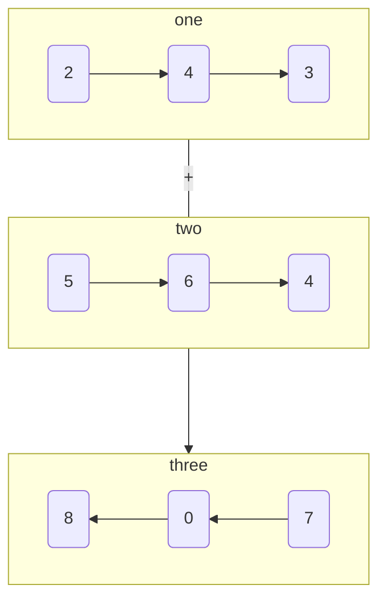

# 两数相加

import CodeBlock from '@theme/CodeBlock';
import TestCode from '!!raw-loader!./addTwoNumber.test';
import SourceCode from '!!raw-loader!./index.ts';
import Tabs from '@theme/Tabs';
import TabItem from '@theme/TabItem';
import CodeSandpack from '@site/src/components/CodeSandpack';

[leetCode](https://leetcode.cn/problems/add-two-numbers/)

:::info
给你两个 非空 的链表，表示两个非负的整数。它们每位数字都是按照 逆序 的方式存储的，并且每个节点只能存储 一位 数字。

请你将两个数相加，并以相同形式返回一个表示和的链表。

你可以假设除了数字 0 之外，这两个数都不会以 0 开头。

:::

<CodeSandpack
  id={'2'}
  activePath='/index.ts'
  visibleFiles={["/index.ts", "/addTwoNumber.test.ts"]}
  files={{
    '/index.ts': SourceCode,
    '/addTwoNumber.test.ts': TestCode
  }}
/>

