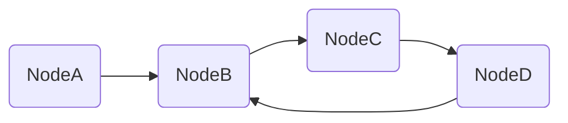

# 环形链表II

import CodeBlock from '@theme/CodeBlock';
import TestCode from '!!raw-loader!./circleLinkListII.test';
import SourceCode from '!!raw-loader!./index.ts';
import Tabs from '@theme/Tabs';
import TabItem from '@theme/TabItem';
import CodeSandpack from '@site/src/components/CodeSandpack';

[leetCode](https://leetcode.cn/problems/linked-list-cycle-ii/)

:::info
给定一个链表的头节点  head ，返回链表开始入环的第一个节点。 如果链表无环，则返回 null。

如果链表中有某个节点，可以通过连续跟踪 next 指针再次到达，则链表中存在环。 为了表示给定链表中的环，评测系统内部使用整数 pos 来表示链表尾连接到链表中的位置（索引从 0 开始）。如果 pos 是 -1，则在该链表中没有环。注意：pos 不作为参数进行传递，仅仅是为了标识链表的实际情况。

不允许修改 链表。

:::

<CodeSandpack
  activePath='/index.ts'
  visibleFiles={["/index.ts", "/circleLinkListII.test.ts"]}
  files={{
    '/index.ts': SourceCode,
    '/circleLinkListII.test.ts': TestCode
  }}
/>
