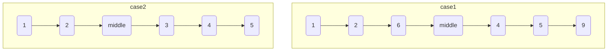

# 删除中间节点

import CodeBlock from '@theme/CodeBlock';
import TestCode from '!!raw-loader!./deleteMiddleNode.test';
import SourceCode from '!!raw-loader!./index.ts';
import Tabs from '@theme/Tabs';
import TabItem from '@theme/TabItem';
import CodeSandpack from '@site/src/components/CodeSandpack';

[leetCode](https://leetcode.cn/problems/delete-middle-node-lcci/)

:::info

若链表中的某个节点，既不是链表头节点，也不是链表尾节点，则称其为该链表的「中间节点」。

假定已知链表的某一个中间节点，请实现一种算法，将该节点从链表中删除。

例如，传入节点 c（位于单向链表 a->b->c->d->e->f 中），将其删除后，剩余链表为 a->b->d->e->f

:::

<CodeSandpack
  id={'2'}
  activePath='/index.ts'
  visibleFiles={["/index.ts", "/deleteMiddleNode.test.ts"]}
  files={{
    '/index.ts': SourceCode,
    '/deleteMiddleNode.test.ts': TestCode
  }}
/>
