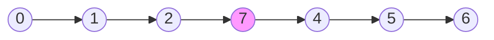
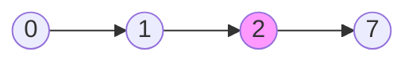
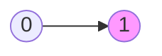

# 删除链表的中间节点

import CodeBlock from '@theme/CodeBlock';
import TestCode from '!!raw-loader!./deleteMiddleNodeII.test';
import SourceCode from '!!raw-loader!./index.ts';
import Tabs from '@theme/Tabs';
import TabItem from '@theme/TabItem';
import CodeSandpack from '@site/src/components/CodeSandpack';

[leetCode](https://leetcode.cn/problems/delete-the-middle-node-of-a-linked-list/)

与之类似的[删除中间节点](/docs/algo-linkList/leetCode/deleteMiddleNode/)

:::info
给你一个链表的头节点 `head` 。删除 链表的 中间节点 ，并返回修改后的链表的头节点 head 。

长度为 `n` 链表的中间节点是从头数起第 `⌊n / 2⌋` 个节点（下标从 0 开始），其中 `⌊x⌋` 表示小于或等于 `x` 的最大整数。

对于 `n = 1、2、3、4` 和 5 的情况，中间节点的下标分别是 `0、1、1、2 和 2` 。

示例1:

示例2:

示例3:

:::

该题的解法类似于**查找链表的中间节点**, 利用哨兵节点来记录慢节点的位置，等快节点结束之后，慢节点的
位置(前一个节点)找到了，最后删除中间节点。

<CodeSandpack
  activePath='/index.ts'
  visibleFiles={["/index.ts", "/deleteMiddleNodeII.test.ts"]}
  files={{
    '/index.ts': SourceCode,
    '/deleteMiddleNodeII.test.ts': TestCode
  }}
/>