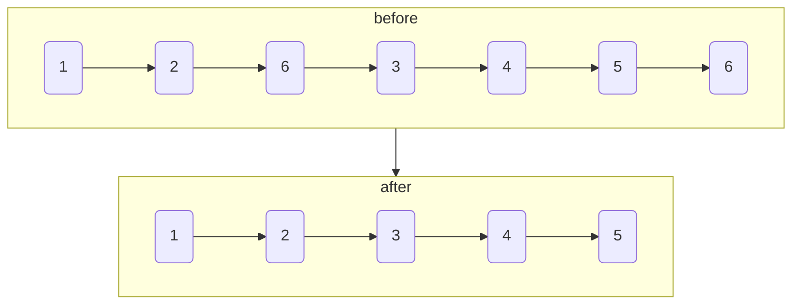

# 删除链表的节点

import CodeBlock from '@theme/CodeBlock';
import TestCode from '!!raw-loader!./deleteNodeLinkList.test';
import SourceCode from '!!raw-loader!./index.ts';
import Tabs from '@theme/Tabs';
import TabItem from '@theme/TabItem';
import CodeSandpack from '@site/src/components/CodeSandpack';

[leetCode](https://leetcode.cn/problems/shan-chu-lian-biao-de-jie-dian-lcof/)

类似的题 [移除链表元素](https://leetcode.cn/problems/remove-linked-list-elements/description/)

:::info

给你一个链表的头节点 head 和一个整数 val ，请你删除链表中所有满足 Node.val == val 的节点，并返回 新的头节点 。

:::

<CodeSandpack
  id={'2'}
  activePath='/index.ts'
  visibleFiles={["/index.ts", "/deleteNodeLinkList.test.ts"]}
  files={{
    '/index.ts': SourceCode,
    '/deleteNodeLinkList.test.ts': TestCode
  }}
/>
