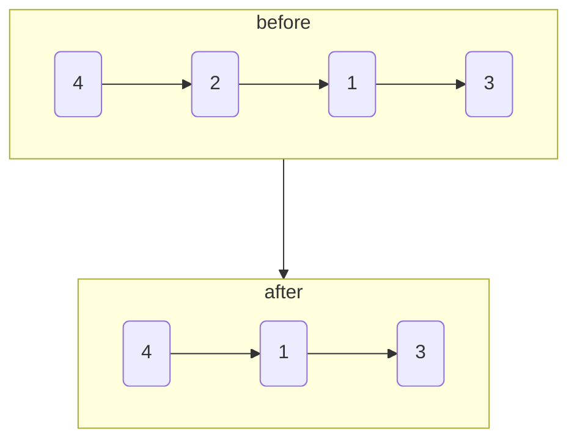

# 删除链表中的节点II

import CodeBlock from '@theme/CodeBlock';
import TestCode from '!!raw-loader!./deleteNodeLinkListII.test';
import SourceCode from '!!raw-loader!./index.ts';
import Tabs from '@theme/Tabs';
import TabItem from '@theme/TabItem';
import CodeSandpack from '@site/src/components/CodeSandpack';

[leetCode](https://leetcode.cn/problems/delete-node-in-a-linked-list/description/)

:::info
有一个单链表的 head，我们想删除它其中的一个节点 node。

给你一个需要删除的节点 node 。你将 无法访问 第一个节点  head。

链表的所有值都是 唯一的，并且保证给定的节点 node 不是链表中的最后一个节点。

删除给定的节点。注意，删除节点并不是指从内存中删除它。这里的意思是：

- 给定节点的值不应该存在于链表中。
- 链表中的节点数应该减少 1。
- node 前面的所有值顺序相同。
- node 后面的所有值顺序相同。

自定义测试：

- 对于输入，你应该提供整个链表 head 和要给出的节点 node。node 不应该是链表的最后一个节点，而应该是链表中的一个实际节点。
- 我们将构建链表，并将节点传递给你的函数。
- 输出将是调用你函数后的整个链表。

如下图:

:::info

<CodeSandpack
  id={'20'}
  activePath='/index.ts'
  visibleFiles={["/index.ts", "/deleteNodeLinkListII.test.ts"]}
  files={{
    '/index.ts': SourceCode,
    '/deleteNodeLinkListII.test.ts': TestCode
  }}
/>