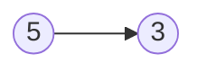

# 临界点之间的最小和最大距离

import CodeBlock from '@theme/CodeBlock';
import TestCode from '!!raw-loader!./findMinMaxNode.test';
import SourceCode from '!!raw-loader!./index.ts';
import Tabs from '@theme/Tabs';
import TabItem from '@theme/TabItem';
import CodeSandpack from '@site/src/components/CodeSandpack';

[leetCode](https://leetcode.cn/problems/find-the-minimum-and-maximum-number-of-nodes-between-critical-points/)

:::info

链表中的 临界点 定义为一个 `局部极大值点` 或 `局部极小值点` 。

如果当前节点的值 严格大于 前一个节点和后一个节点，那么这个节点就是一个  局部极大值点 。

如果当前节点的值 严格小于 前一个节点和后一个节点，那么这个节点就是一个  局部极小值点 。

注意：节点只有在同时存在前一个节点和后一个节点的情况下，才能成为一个 局部极大值点 / 极小值点 。

给你一个链表 `head` ，返回一个长度为 `2` 的数组 `[minDistance, maxDistance]` ，其中 `minDistance` `是任意两个不同临界点之间的最小距离，maxDistance` 是任意两个不同临界点之间的最大距离。如果临界点少于两个，则返回 `[-1，-1]` 。

:::

示例1:


```
输入：head = [5,3,1,2,5,1,2]
输出：[1,3]
解释：存在三个临界点：
- [5,3,1,2,5,1,2]：第三个节点是一个局部极小值点，因为 1 比 3 和 2 小。
- [5,3,1,2,5,1,2]：第五个节点是一个局部极大值点，因为 5 比 2 和 1 大。
- [5,3,1,2,5,1,2]：第六个节点是一个局部极小值点，因为 1 比 5 和 2 小。
第五个节点和第六个节点之间距离最小。minDistance = 6 - 5 = 1 。
第三个节点和第六个节点之间距离最大。maxDistance = 6 - 3 = 3 。
```

示例2:



```
输入：head = [3,1]
输出：[-1,-1]
解释：链表 [3,1] 中不存在临界点。
```

**遍历一次链表**

在遍历的过程中，关键的一点记录**最小极点的位置（只记录一次）**, 在找到下一个
极点的时候，就可以计算极点之间的最小、最大的距离差。

每一次遍历结束（找到极点的情况），记录最大极点的位置。


<CodeSandpack
  activePath='/index.ts'
  visibleFiles={["/index.ts", "/findMinMaxNode.test.ts"]}
  files={{
    '/index.ts': SourceCode,
    '/findMinMaxNode.test.ts': TestCode
  }}
/>