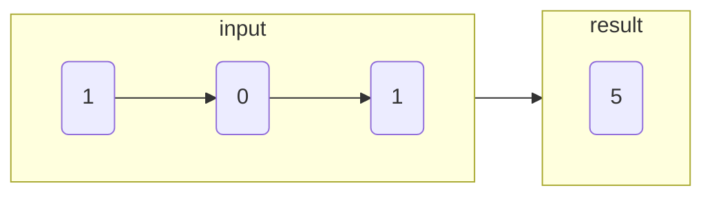

# 二进制链表转整数

import CodeBlock from '@theme/CodeBlock';
import TestCode from '!!raw-loader!./getDecimalValue.test';
import SourceCode from '!!raw-loader!./index.ts';
import Tabs from '@theme/Tabs';
import TabItem from '@theme/TabItem';
import CodeSandpack from '@site/src/components/CodeSandpack';

[leetCode](https://leetcode.cn/problems/convert-binary-number-in-a-linked-list-to-integer/)

:::info
给你一个单链表的引用结点 head。链表中每个结点的值不是 0 就是 1。已知此链表是一个整数数字的二进制表示形式。

请你返回该链表所表示数字的 十进制值 。

:::

<CodeSandpack
  id={'2'}
  activePath='/index.ts'
  visibleFiles={["/index.ts", "/getDecimalValue.test.ts"]}
  files={{
    '/index.ts': SourceCode,
    '/getDecimalValue.test.ts': TestCode
  }}
/>
