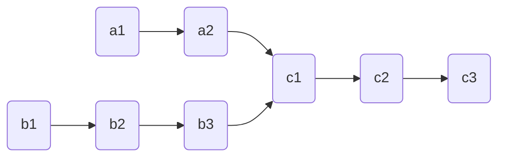

# 相交链表

import CodeBlock from '@theme/CodeBlock';
import TestCode from '!!raw-loader!./intersectionLinkList.test';
import SourceCode from '!!raw-loader!./index.ts';
import Tabs from '@theme/Tabs';
import TabItem from '@theme/TabItem';
import CodeSandpack from '@site/src/components/CodeSandpack';

[leetCode](https://leetcode.cn/problems/intersection-of-two-linked-lists/)

:::info
给你两个单链表的头节点 headA 和 headB ，请你找出并返回两个单链表相交的起始节点。如果两个链表不存在相交节点，返回 null 。

图示两个链表在节点 c1 开始相交：

:::

<CodeSandpack
  id={'2'}
  activePath='/index.ts'
  visibleFiles={["/index.ts", "/circleLinkList.test.ts"]}
  files={{
    '/index.ts': SourceCode,
    '/circleLinkList.test.ts': TestCode
  }}
/>