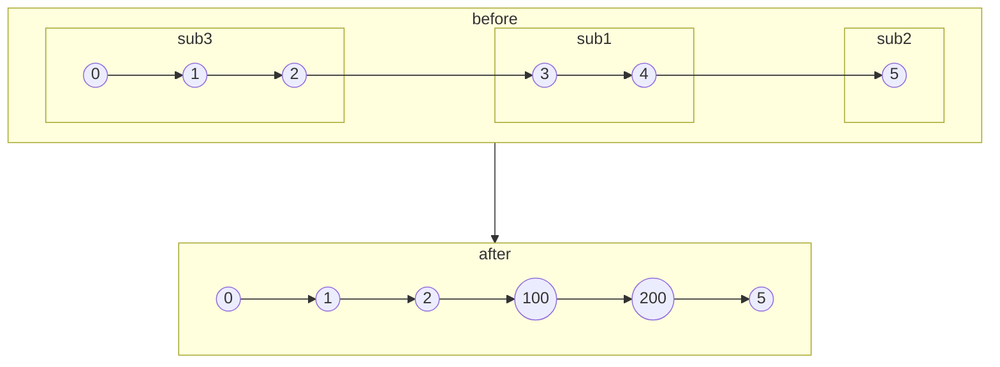

# 合并两个链表

import CodeBlock from '@theme/CodeBlock';
import TestCode from '!!raw-loader!./mergeBetweenLinkList.test';
import SourceCode from '!!raw-loader!./index.ts';
import Tabs from '@theme/Tabs';
import TabItem from '@theme/TabItem';
import CodeSandpack from '@site/src/components/CodeSandpack';

[leetCode](https://leetcode.cn/problems/merge-in-between-linked-lists/)

:::info
给你两个链表 list1 和 list2 ，它们包含的元素分别为 n 个和 m 个。

请你将 list1 中下标从 a 到 b 的全部节点都删除，并将list2 接在被删除节点的位置。

list1为`[0, 1, 2, 3, 4, 5]`

list2为`[100,200]`

下图中展示了操作后的结果：

:::

<CodeSandpack
  activePath='/index.ts'
  visibleFiles={["/index.ts", "/mergeBetweenLinkList.test.ts"]}
  files={{
    '/index.ts': SourceCode,
    '/mergeBetweenLinkList.test.ts': TestCode
  }}
/>