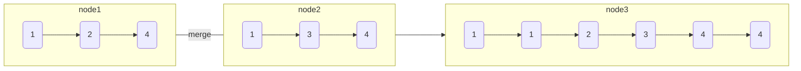

# 合并两个有序链表

import CodeBlock from '@theme/CodeBlock';
import TestCode from '!!raw-loader!./mergeTwoLinkList.test';
import SourceCode from '!!raw-loader!./index.ts';
import Tabs from '@theme/Tabs';
import TabItem from '@theme/TabItem';
import CodeSandpack from '@site/src/components/CodeSandpack';

[leetCode](https://leetcode.cn/problems/merge-two-sorted-lists/)

:::info

将两个升序链表合并为一个新的 升序 链表并返回。新链表是通过拼接给定的两个链表的所有节点组成的。 

:::

<CodeSandpack
  id={'2'}
  activePath='/index.ts'
  visibleFiles={["/index.ts", "/mergeTwoLinkList.test.ts"]}
  files={{
    '/index.ts': SourceCode,
    '/mergeTwoLinkList.test.ts': TestCode
  }}
/>
