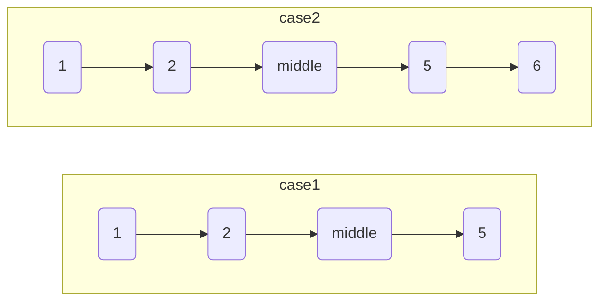

# 链表的中间结点

import CodeBlock from '@theme/CodeBlock';
import TestCode from '!!raw-loader!./middleLinkList.test';
import SourceCode from '!!raw-loader!./index.ts';
import Tabs from '@theme/Tabs';
import TabItem from '@theme/TabItem';
import CodeSandpack from '@site/src/components/CodeSandpack';

[leetCode](https://leetcode.cn/problems/middle-of-the-linked-list/)

:::info
给你单链表的头结点 head ，请你找出并返回链表的中间结点。

如果有两个中间结点，则返回第二个中间结点。

:::

<CodeSandpack
  id={'2'}
  activePath='/index.ts'
  visibleFiles={["/index.ts", "/middleLinkList.test.ts"]}
  files={{
    '/index.ts': SourceCode,
    '/middleLinkList.test.ts': TestCode
  }}
/>
