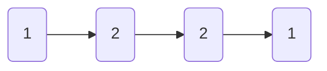

# 回文链表

import CodeBlock from '@theme/CodeBlock';
import TestCode from '!!raw-loader!./palindromeLlinkList.test';
import SourceCode from '!!raw-loader!./index.ts';
import Tabs from '@theme/Tabs';
import TabItem from '@theme/TabItem';
import CodeSandpack from '@site/src/components/CodeSandpack';

[leetCode](https://leetcode.cn/problems/palindrome-linked-list/)

:::info
给你一个单链表的头节点 head ，请你判断该链表是否为回文链表。如果是，返回 true ；否则，返回 false 。

:::

<CodeSandpack
  id={'2'}
  activePath='/index.ts'
  visibleFiles={["/index.ts", "/palindromeLlinkList.test.ts"]}
  files={{
    '/index.ts': SourceCode,
    '/palindromeLlinkList.test.ts': TestCode
  }}
/>
