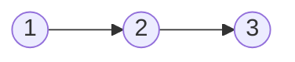
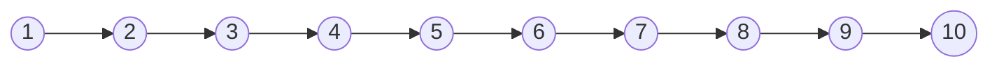

# 分隔链表II

import CodeBlock from '@theme/CodeBlock';
import TestCode from '!!raw-loader!./partitionLInkListII.test';
import SourceCode from '!!raw-loader!./index.ts';
import Tabs from '@theme/Tabs';
import TabItem from '@theme/TabItem';
import CodeSandpack from '@site/src/components/CodeSandpack';

[leetCode](https://leetcode.cn/problems/split-linked-list-in-parts/description/)


:::info
给你一个头结点为 head 的单链表和一个整数 `k` ，请你设计一个算法将链表分隔为 `k` 个连续的部分。

每部分的长度应该尽可能的相等：任意两部分的长度差距不能超过 1 。这可能会导致有些部分为 `null` 。

这 `k` 个部分应该按照在链表中出现的顺序排列，并且排在前面的部分的长度应该大于或等于排在后面的长度。

返回一个由上述 `k` 部分组成的数组。

:::

示例1:



```
输入：head = [1,2,3], k = 5
输出：[[1],[2],[3],[],[]]
解释：
第一个元素 output[0] 为 output[0].val = 1 ，output[0].next = null 。
最后一个元素 output[4] 为 null ，但它作为 ListNode 的字符串表示是 [] 。
```

示例2:



```
输入：head = [1,2,3,4,5,6,7,8,9,10], k = 3
输出：[[1,2,3,4],[5,6,7],[8,9,10]]
解释：
输入被分成了几个连续的部分，并且每部分的长度相差不超过 1 。前面部分的长度大于等于后面部分的长度。
```

**题解过程**

- 首先获取链表的长度，得到每个`part`中放几个节点以及剩下的节点`remainder`
- 如果长度是偶数，则前面几个`part`则会多放`remainder/k`个节点
- 最后每放一段节点，则需要断开相邻的两段链表

<CodeSandpack
  activePath='/index.ts'
  visibleFiles={["/index.ts", "/partitionLInkListII.test.ts"]}
  files={{
    '/index.ts': SourceCode,
    '/partitionLInkListII.test.ts': TestCode
  }}
/>