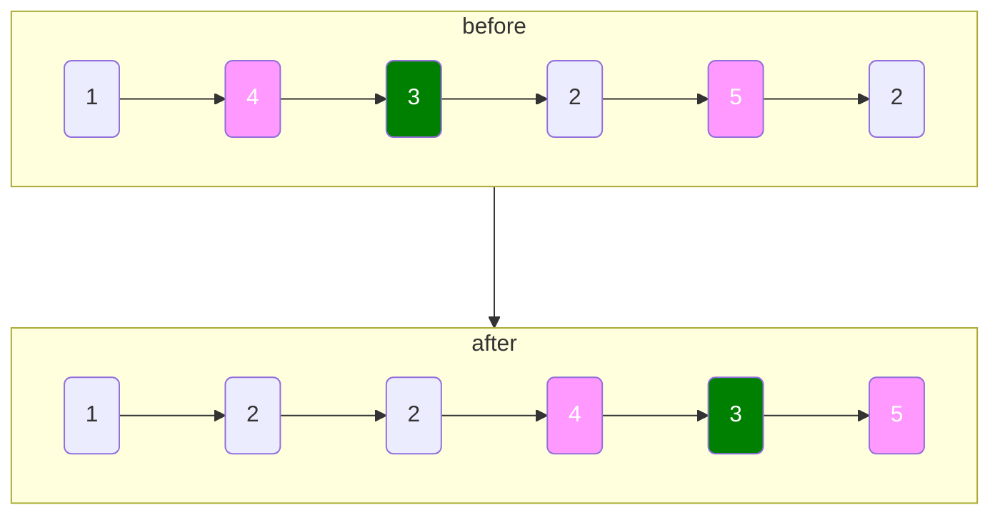

# 分隔链表

import CodeBlock from '@theme/CodeBlock';
import TestCode from '!!raw-loader!./partitionLinkList.test';
import SourceCode from '!!raw-loader!./index.ts';
import Tabs from '@theme/Tabs';
import TabItem from '@theme/TabItem';
import CodeSandpack from '@site/src/components/CodeSandpack';

[leetCode](https://leetcode.cn/problems/partition-list/)

:::info
给你一个链表的头节点 head 和一个特定值 x ，请你对链表进行分隔，使得所有 小于 x 的节点都出现在 大于或等于 x 的节点之前。

你应当 保留 两个分区中每个节点的初始相对位置。

:::

<CodeSandpack
  id={'2'}
  activePath='/index.ts'
  visibleFiles={["/index.ts", "/partitionLinkList.test.ts"]}
  files={{
    '/index.ts': SourceCode,
    '/partitionLinkList.test.ts': TestCode
  }}
/>

