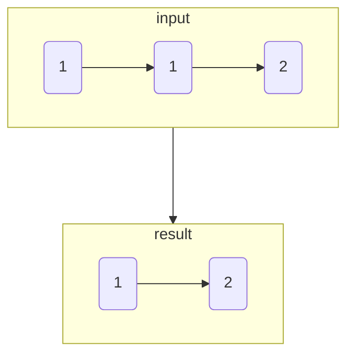

# 删除排序链表中的重复元素

import CodeBlock from '@theme/CodeBlock';
import TestCode from '!!raw-loader!./removeDuplicateSorted.test';
import SourceCode from '!!raw-loader!./index.ts';
import Tabs from '@theme/Tabs';
import TabItem from '@theme/TabItem';
import CodeSandpack from '@site/src/components/CodeSandpack';

[leetCode](https://leetcode.cn/problems/remove-duplicates-from-sorted-list/)

:::info
给定一个已排序的链表的头 head ， 删除所有重复的元素，使每个元素只出现一次 。返回 已排序的链表 。

:::

<CodeSandpack
  id={'20'}
  activePath='/index.ts'
  visibleFiles={["/index.ts", "/removeDuplicateSorted.test.ts"]}
  files={{
    '/index.ts': SourceCode,
    '/removeDuplicateSorted.test.ts': TestCode
  }}
/>

