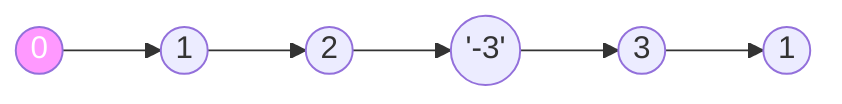
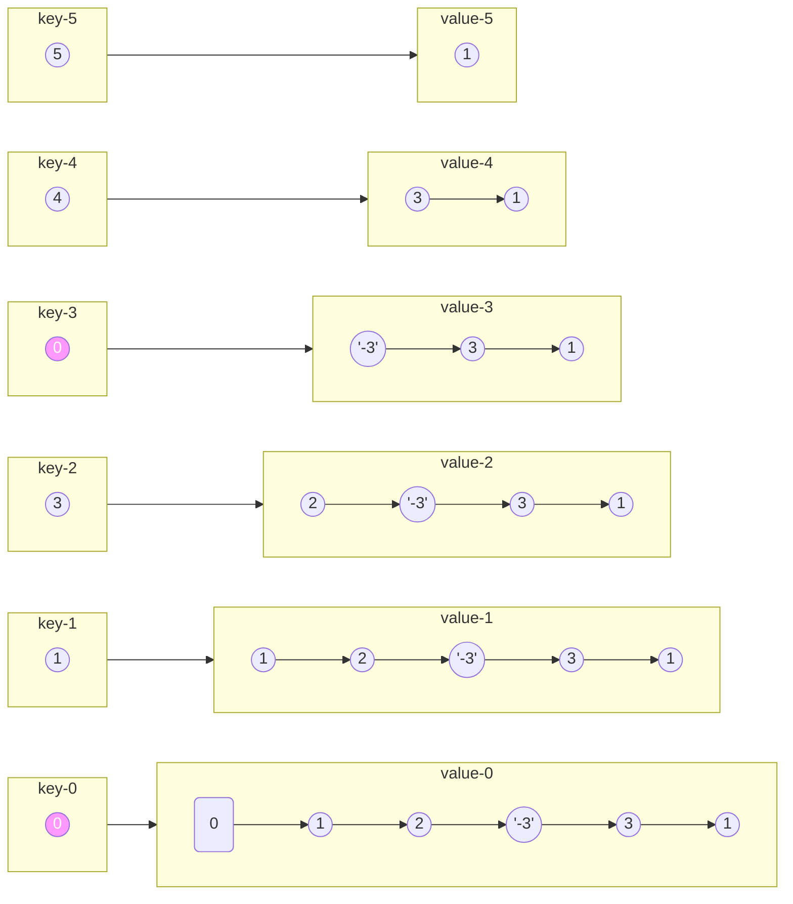
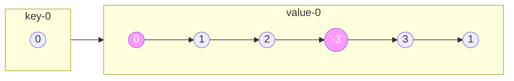

# 从链表中删去总和值为零的连续节点

import CodeBlock from '@theme/CodeBlock';
import TestCode from '!!raw-loader!./problem.test';
import SourceCode from '!!raw-loader!./index.ts';
import Tabs from '@theme/Tabs';
import TabItem from '@theme/TabItem';
import CodeSandpack from '@site/src/components/CodeSandpack';

[leetCode](https://leetcode.cn/problems/remove-zero-sum-consecutive-nodes-from-linked-list/description/)

:::info
给你一个链表的头节点 head，请你编写代码，反复删去链表中由 总和 值为 0 的连续节点组成的序列，直到不存在这样的序列为止。

删除完毕后，请你返回最终结果链表的头节点。

你可以返回任何满足题目要求的答案。

（注意，下面示例中的所有序列，都是对 ListNode 对象序列化的表示。）
:::

示例1
```
输入：head = [1,2,-3,3,1]
输出：[3,1]
提示：答案 [1,2,1] 也是正确的。
```

示例2
```
输入：head = [1,2,3,-3,4]
输出：[1,2,4]
```

**前缀和+HashMap**

首先利用哨兵节点建立一个新的链表`dummy`, 哨兵节点的值初始为`0`


--> A((1)) --> D((2)) --> C(('-3')) --> E((3)) --> F((1))

1. 第一遍遍历链表，记录每个节点的前缀和`prefix`, 用`hashMap[prefix]`记录当前节点，直到遍历结束



从上图可以看到，每个节点的前缀和以及其对应的链表，其中有两个key值一样的链表，此时需要用最新的覆盖上一个
至此，前缀和的HashMap已经有了。

2. 第二遍遍历链表，重新计算前缀和，此时前缀和在HashMap对应的节点的前面的节点的前缀和为0，是需要删除的节点。




此时可以看到，B节点和C节点(包括C节点)中间的节点是需要删除的，因此在遍历的时候只需
`node.next = hashMap[prefix].next`即可删掉中间的链表

<CodeSandpack
  activePath='/index.ts'
  visibleFiles={["/index.ts", "/problem.test.ts"]}
  files={{
    '/index.ts': SourceCode,
    '/problem.test.ts': TestCode
  }}
/>
