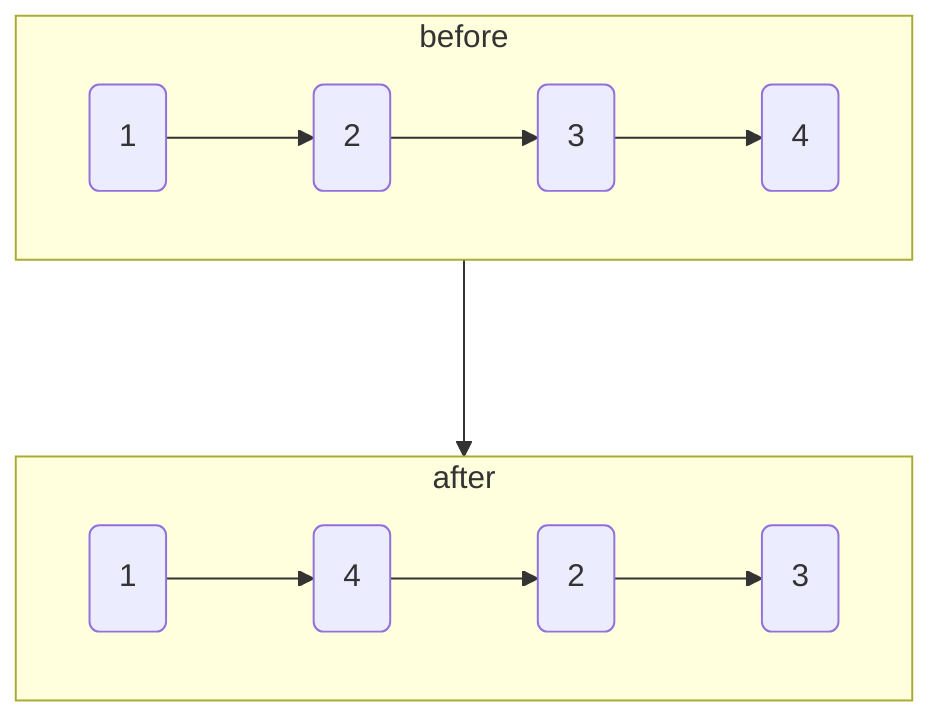

# 重排链表

import CodeBlock from '@theme/CodeBlock';
import TestCode from '!!raw-loader!./reorderLinkList.test';
import SourceCode from '!!raw-loader!./index.ts';
import Tabs from '@theme/Tabs';
import TabItem from '@theme/TabItem';
import CodeSandpack from '@site/src/components/CodeSandpack';

[leetCode](https://leetcode.cn/problems/reorder-list/)


:::info
给定一个单链表 `L` 的头节点 `head` ，单链表 `L` 表示为：

```
L0 → L1 → … → Ln - 1 → Ln
```

请将其重新排列后变为：

```
L0 → Ln → L1 → Ln - 1 → L2 → Ln - 2 → …
```

不能只是单纯的改变节点内部的值，而是需要实际的进行节点交换。


:::
