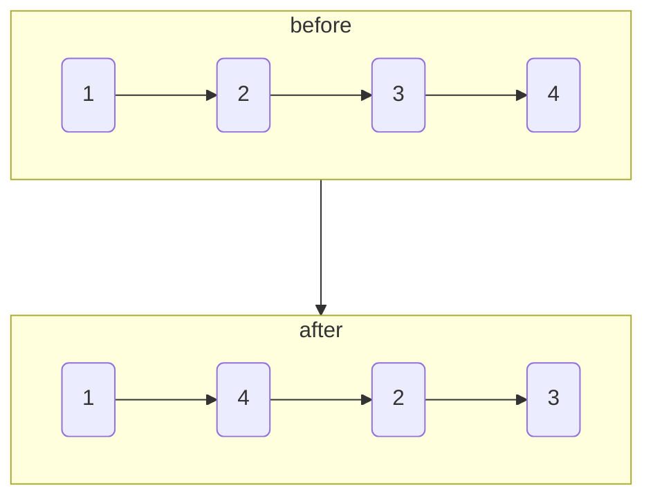
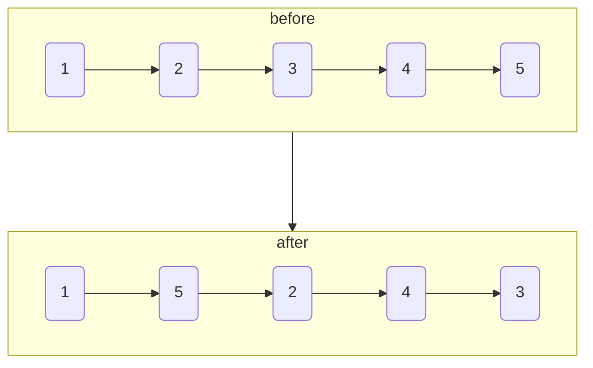

# 重排链表

import CodeBlock from '@theme/CodeBlock';
import TestCode from '!!raw-loader!./reorderLinkList.test';
import SourceCode from '!!raw-loader!./index.ts';
import Tabs from '@theme/Tabs';
import TabItem from '@theme/TabItem';
import CodeSandpack from '@site/src/components/CodeSandpack';

[leetCode](https://leetcode.cn/problems/reorder-list/)


:::info
给定一个单链表 `L` 的头节点 `head` ，单链表 `L` 表示为：

```
L0 → L1 → … → Ln - 1 → Ln
```

请将其重新排列后变为：

```
L0 → Ln → L1 → Ln - 1 → L2 → Ln - 2 → …
```

不能只是单纯的改变节点内部的值，而是需要实际的进行节点交换。

示例1



示例2



:::


## 暴力求解

暴力求解首先需要两层遍历：
- 外层遍历链表是否已经结束，但是需要保证链表尾部有需要交换的节点`cur.next.next`
- 里层遍历则需要找到交换元素的前一个节点，方便移动节点

具体代码如下：

```ts
function reorderList(head: ListNode | null): void {

  let cur = head;

  while (cur && cur.next !== null && cur.next.next !== null) {
    let fast = cur.next;
    let last = null;
    while (fast && fast.next && fast.next.next) {
      fast = fast.next;
    }
    last = fast;

    const lastNode = last.next;
    last.next = null;

    lastNode.next = cur.next;
    cur.next = lastNode;

    cur = lastNode.next;
  }
};
```
暴力求解的时间复杂度`O(m * n)`，`m`为链表的长度，`n`为里层需要遍历的长度，所以暴力求解虽然
在原地求解，但是耗时太长了，不宜使用。


## 利用线性表

利用线性表则可以省去暴力求解中*查找里层的时间*，空间换时间。


```ts
// 1 2 3 4 5

// 1 -> [2, 3, 4, 5],
// 2 -> [3, 4, 5],
// 3 -> [4, 5],
// 4 -> [5],
// 5 -> [],

// 1 -> [2, 3, 4, 5], ---> 1 -> 5
// 5 -> [],           ---> 5 -> 2 -> [3, 4, 5],
// 2 -> [3, 4, 5],    ---> 2 -> 4 -> [5],
// 4 -> [5],          ---> 4 -> 3 -> [4, 5]

function reorderList(head: ListNode | null): void {

  if (head === null || head.next === null) return;

  const listNode: ListNode[] = [];
  let node = head;
  while (node !== null) { 
    listNode.push(node);
    node = node.next;
  }

  let i = 0;
  let j = listNode.length - 1;
  while (i < j) {
    listNode[i++].next = listNode[j];
    if (i === j) break;
    listNode[j--].next = listNode[i];
  }

  // 最后一个节点.next 置空
  listNode[i].next = null;
};

```


## 单元测试


<CodeSandpack
  activePath='/index.ts'
  visibleFiles={["/index.ts", "/reorderLinkList.test.ts"]}
  files={{
    '/index.ts': SourceCode,
    '/reorderLinkList.test.ts': TestCode
  }}
/>