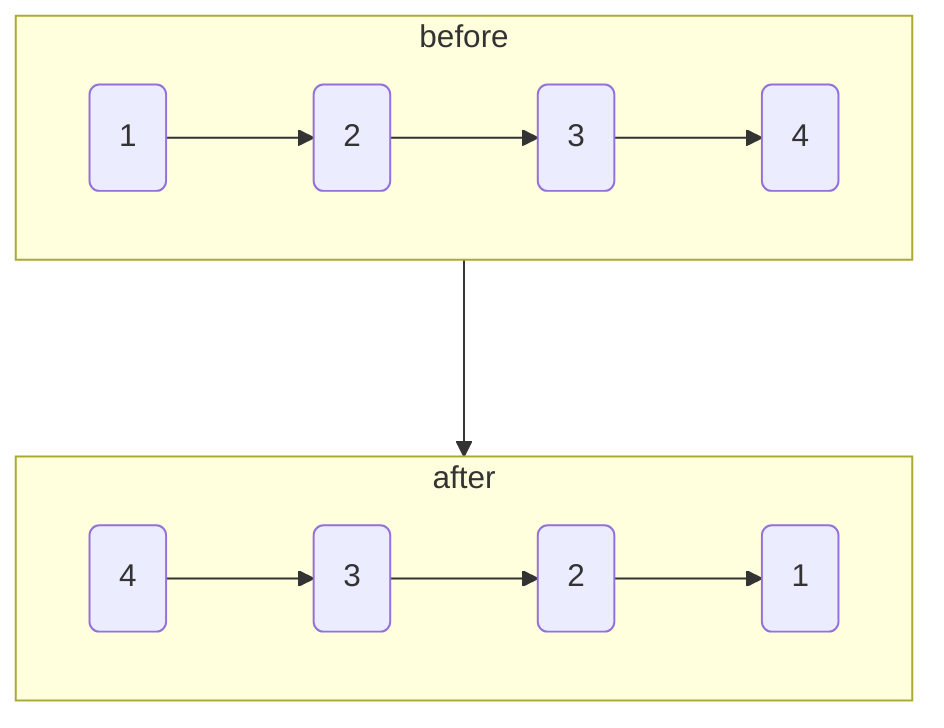

# 反转链表

import CodeBlock from '@theme/CodeBlock';
import TestCode from '!!raw-loader!./reverseSingleList.test';
import SourceCode from '!!raw-loader!./index.ts';
import Tabs from '@theme/Tabs';
import TabItem from '@theme/TabItem';
import CodeSandpack from '@site/src/components/CodeSandpack';

[leetCode](https://leetcode.cn/problems/reverse-linked-list/)

:::info
给你单链表的头节点 head ，请你反转链表，并返回反转后的链表。

:::

<CodeSandpack
  id={'20'}
  activePath='/index.ts'
  visibleFiles={["/index.ts", "/reverseSingleList.test.ts"]}
  files={{
    '/index.ts': SourceCode,
    '/reverseSingleList.test.ts': TestCode
  }}
/>

