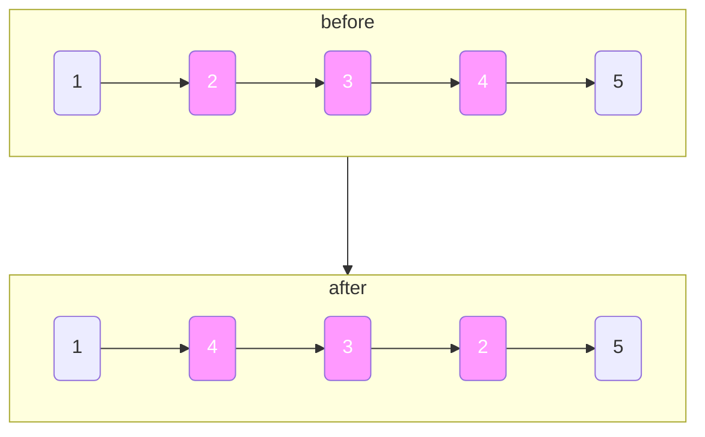

# 反转链表II

import CodeBlock from '@theme/CodeBlock';
import TestCode from '!!raw-loader!./reverseLinkListII.test';
import SourceCode from '!!raw-loader!./index.ts';
import Tabs from '@theme/Tabs';
import TabItem from '@theme/TabItem';
import CodeSandpack from '@site/src/components/CodeSandpack';

[leetCode](https://leetcode.cn/problems/reverse-linked-list-ii/)

:::info
给你单链表的头指针 head 和两个整数 left 和 right ，其中 left <= right 。请你反转从位置 left 到位置 right 的链表节点，返回 反转后的链表 。

:::

<CodeSandpack
  id={'20'}
  activePath='/index.ts'
  visibleFiles={["/index.ts", "/reverseLinkListII.test.ts"]}
  files={{
    '/index.ts': SourceCode,
    '/reverseLinkListII.test.ts': TestCode
  }}
/>
