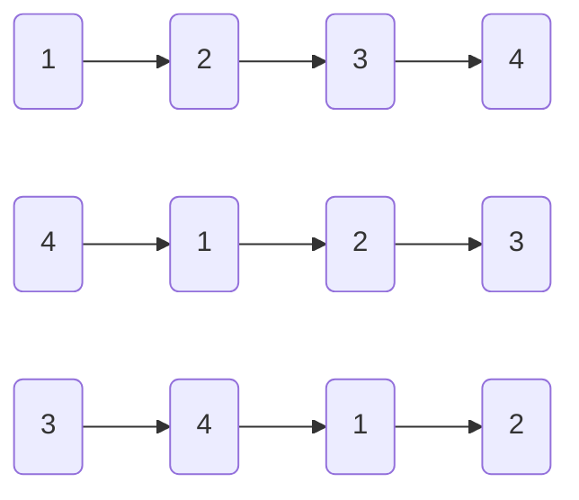

# 旋转链表

import CodeBlock from '@theme/CodeBlock';
import TestCode from '!!raw-loader!./rotateLinkList.test';
import SourceCode from '!!raw-loader!./index.ts';
import Tabs from '@theme/Tabs';
import TabItem from '@theme/TabItem';
import CodeSandpack from '@site/src/components/CodeSandpack';

[leetCode](https://leetcode.cn/problems/rotate-list/)

:::info
给你一个链表的头节点 head ，旋转链表，将链表每个节点向右移动 k 个位置。

:::

<CodeSandpack
  id={'20'}
  activePath='/index.ts'
  visibleFiles={["/index.ts", "/rotateLinkList.test.ts"]}
  files={{
    '/index.ts': SourceCode,
    '/rotateLinkList.test.ts': TestCode
  }}
/>