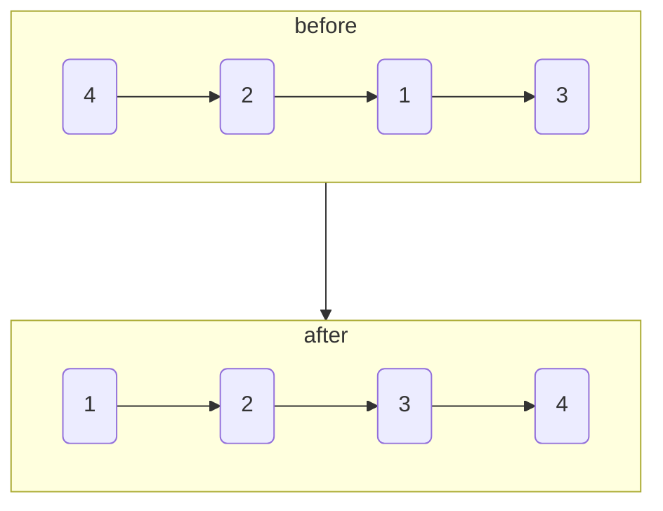
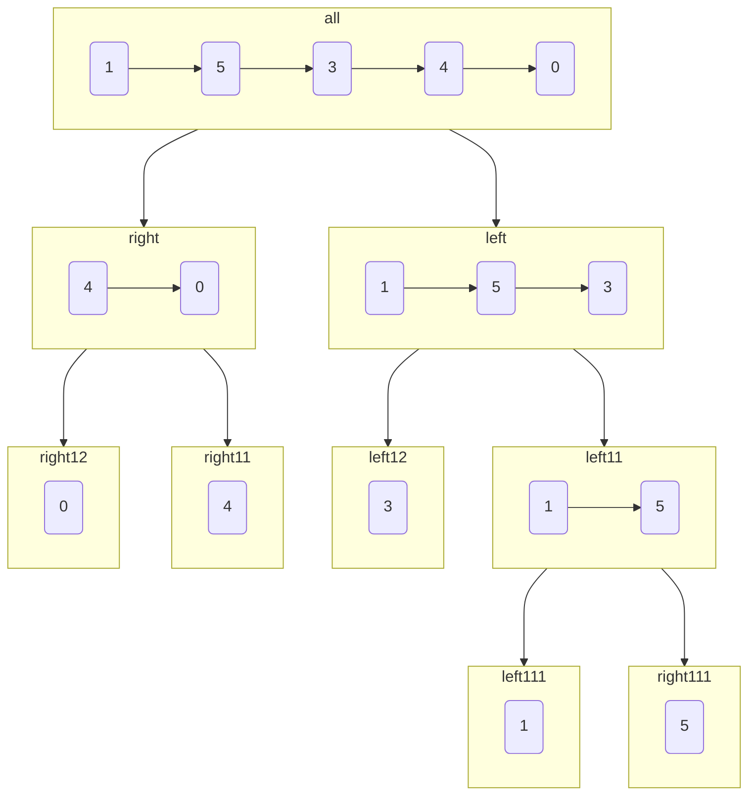
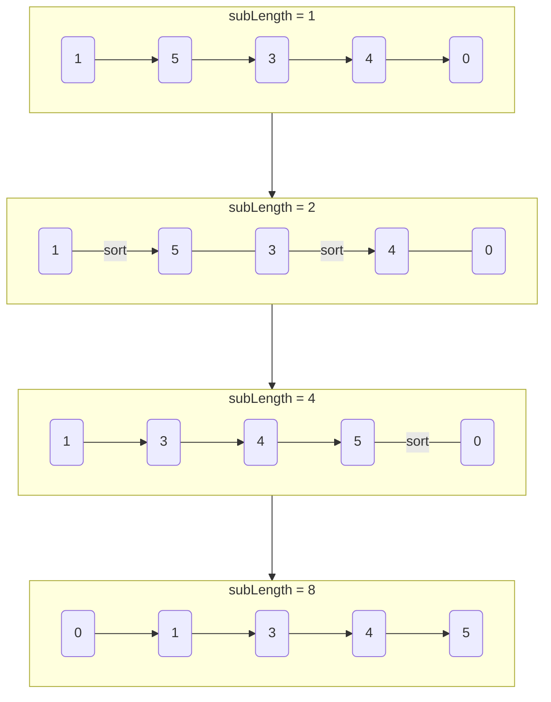

# 排序链表

import CodeBlock from '@theme/CodeBlock';
import TestCode from '!!raw-loader!./sortLinkList.test';
import SourceCode from '!!raw-loader!./index.ts';
import SourceCodeI from '!!raw-loader!./second.ts';
import Tabs from '@theme/Tabs';
import TabItem from '@theme/TabItem';
import CodeSandpack from '@site/src/components/CodeSandpack';


[leetCode](https://leetcode.cn/problems/sort-list/)


:::info
给你链表的头结点 head ，请将其按 升序 排列并返回 排序后的链表 。

```
输入：
输入：head = [1,2,3,4]
输出：[2,1,4,3]
```

如下图:



:::

## 自顶向下归并排序

**排序过程：**

1. 找到链表的中间节点，拆分成两个子链表。拆分方法可见[链表的中间节点](/docs/algo-linkList/leetCode/middleLinkList/)
2. 对两个子链表分别排序
3. 排序后的链表进行合并。合并方法可见[合并两个有序的链表](/docs/algo-linkList/leetCode/mergeTwoLinkList/)

**递归的图示：**



上图展示了*递*的过程，而在*归*的过程则是合并链表


<CodeSandpack
  id={'20'}
  activePath='/index.ts'
  visibleFiles={["/index.ts", "/second.ts", "/sortLinkList.test.ts"]}
  files={{
    '/index.ts': SourceCode,
    '/second.ts': SourceCodeI,
    '/sortLinkList.test.ts': TestCode
  }}
/>


## 自底向上归并排序

**排序过程：**

首先得到链表的总长度`length`，然后将链表拆分成多个子链表进行合并。

1. 用`subLength`表示每次需要排序的子链表的长度，初始值为`subLength = 1`
2. 每次将链表拆分成若干个长度为`subLength`的子链表（最后一个子链表的长度可以小于`subLength`），按照
每两个子链表一组进行合并，合并后即可得到若干个长度为 `subLength * 2`的有序子链表。合并仍然方法可见[合并两个有序的链表](/docs/algo-linkList/leetCode/mergeTwoLinkList/)
3. 将`subLength`的值加倍，重复第二步，对更长的的有序的链表进行合并，知道有序的链表的长度大于或者等于`length`，整个链表排序完成


**排序的图示：**



<CodeSandpack
  id={'20'}
  activePath='/second.ts'
  visibleFiles={["/second.ts", "/index.ts", "/sortLinkList.test.ts"]}
  files={{
    '/index.ts': SourceCode,
    '/second.ts': SourceCodeI,
    '/sortLinkList.test.ts': TestCode
  }}
/>


