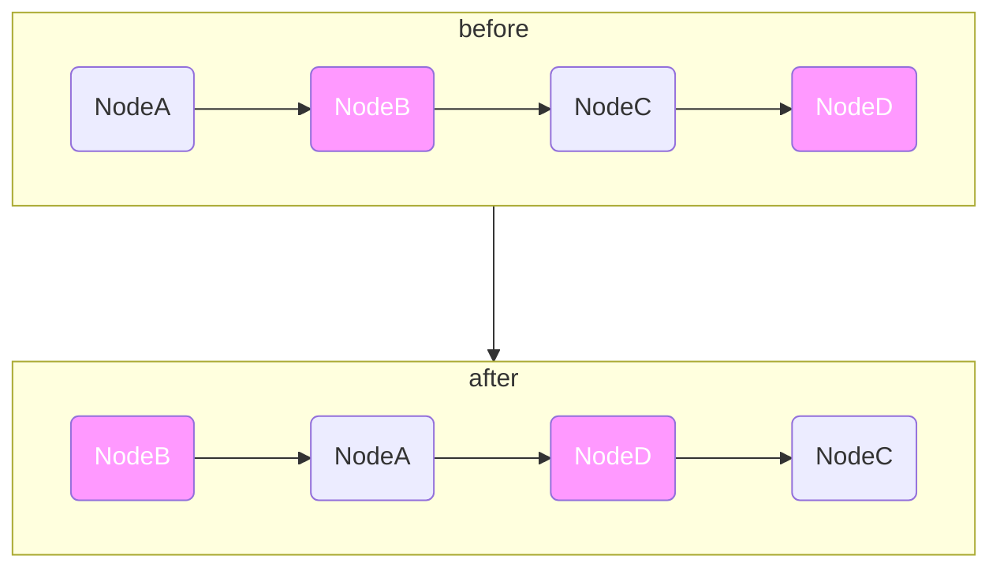

# 两两交换链表中的节点

import CodeBlock from '@theme/CodeBlock';
import TestCode from '!!raw-loader!./swapNodeInPair.test';
import SourceCode from '!!raw-loader!./index.ts';
import Tabs from '@theme/Tabs';
import TabItem from '@theme/TabItem';
import CodeSandpack from '@site/src/components/CodeSandpack';


[leetCode](https://leetcode.cn/problems/swap-nodes-in-pairs/description/)


:::info
给你一个链表，两两交换其中相邻的节点，并返回交换后链表的头节点。你必须在不修改节点内部的值的情况下完成本题（即，只能进行节点交换）。

```
输入：
输入：head = [1,2,3,4]
输出：[2,1,4,3]
```

如下图:



:::


<CodeSandpack
  id={'20'}
  activePath='/index.ts'
  visibleFiles={["/index.ts", "/swapNodeInPair.test.ts"]}
  files={{
    '/index.ts': SourceCode,
    '/swapNodeInPair.test.ts': TestCode
  }}
/>


