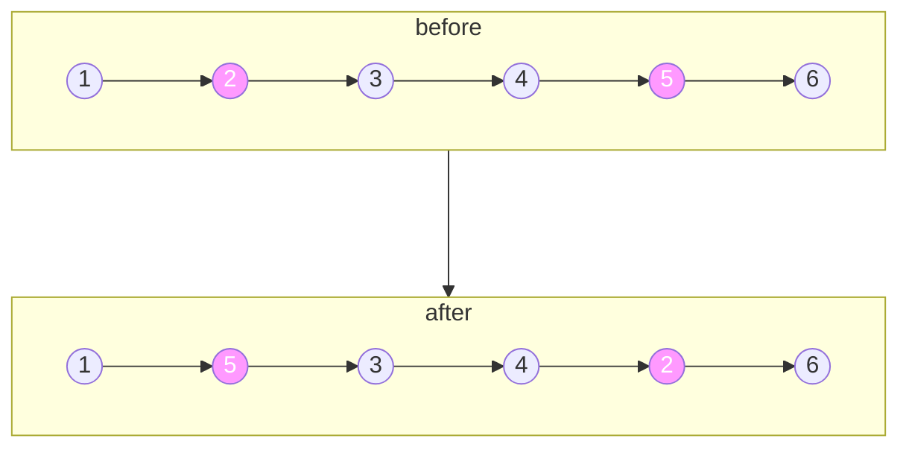

# 交换链表中的节点

import CodeBlock from '@theme/CodeBlock';
import TestCode from '!!raw-loader!./swappingNodeLinkList.test';
import SourceCode from '!!raw-loader!./index.ts';
import Tabs from '@theme/Tabs';
import TabItem from '@theme/TabItem';
import CodeSandpack from '@site/src/components/CodeSandpack';

[leetCode](https://leetcode.cn/problems/swapping-nodes-in-a-linked-list/)

:::info
给你链表的头节点 head 和一个整数 k 。

交换 链表正数第 k 个节点和倒数第 k 个节点的值后，返回链表的头节点（链表 从 1 开始索引）。

如下图:

:::

**遍历交换**

解决该题，正常解法：

首先得到**链表的长度**，其次得到需要交换节点的**前一个节点(方便节点交换)**

接下来需要考虑的有以下几个方面:

- 如果交换的节点是同一个节点，则无需交换，直接返回
- 如果交换的节点是相邻节点，则按照正常交换节点处理
- 如果交换的节点不是相邻节点，则交换两个节点

具体实现如下:

<CodeSandpack
  activePath='/index.ts'
  visibleFiles={["/index.ts", "/swappingNodeLinkList.test.ts"]}
  files={{
    '/index.ts': SourceCode,
    '/swappingNodeLinkList.test.ts': TestCode
  }}
/>