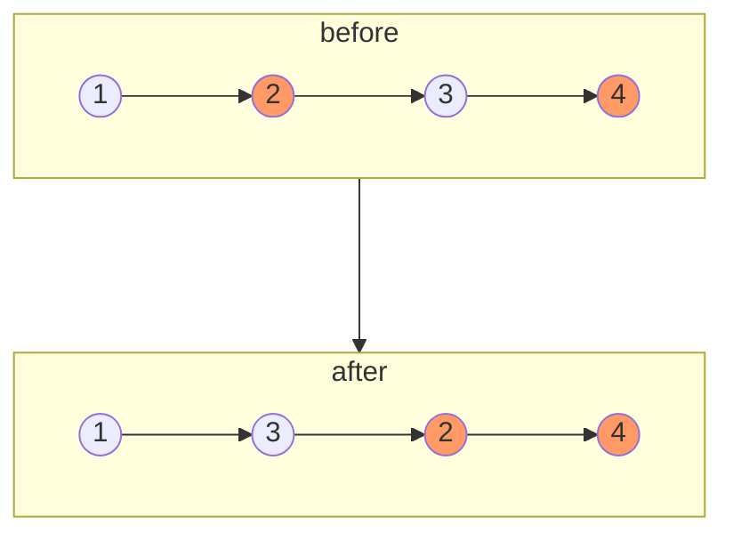

<Note>

给定单链表的头节点 head ，将所有索引为奇数的节点和索引为偶数的节点分别组合在一起，然后返回重新排序的列表。

第一个节点的索引被认为是 奇数 ， 第二个节点的索引为 偶数 ，以此类推。

请注意，偶数组和奇数组内部的相对顺序应该与输入时保持一致。

你必须在 `O(1)` 的额外空间复杂度和 `O(n)` 的时间复杂度下解决这个问题。

示例1

</Note>

首先想到的解法是分别初始化`奇`链表和`偶`链表。
然后遍历整个`head`链表，将不同的节点加入对应的链表，最后将两个链表合并。

但是这种并不满足题目给出的要求。

因此需要在原链表上处理，初始化`node`为偶节点，然后将偶节点与其下一个节点(奇节点)交换之后，
`node.next`还是偶节点。

因此，直到链表的结尾。

满足了时间复杂度`O(n)`和空间复杂度为`O(1)`的要求

